# Animation Retargeting

MetaPerson 2 was originally designed using a Mixamo-compatible skeleton so that Mixamo animations can be easily used with avatars. At the same time, UE5 provides [tools](https://docs.unrealengine.com/5.0/en-US/ik-rig-animation-retargeting-in-unreal-engine/) that can be used to retarget an animation from an Epic skeleton to any other. We will not repeat the official documentation here but will focus on the assets provided with the demo project that can help retarget animations.

As mentioned in documentation, retargeting with IK Rig is achieved by specifying a source and target Skeletal Mesh, which are defined by an IK Rig Asset for each of those meshes. So to retarget animations one needs : Source IKRig for Epic skeleton, Target IKRig for MetaPerson 2, IK Retargeter asset. Demo project contains all of the mentioned assets: */Game/MannequinToMetaperson2/IK_Retargeting/IK_Manny*, */AvatarSDKMetaperson2/Skeleton/Metaperson2_IK_Rig*, */Game/MannequinToMetaperson2/IK_Retargeting/IK_Retargeter_Metaperson2*. 

Both IK Rigs contain definitions for Retarget Chains:

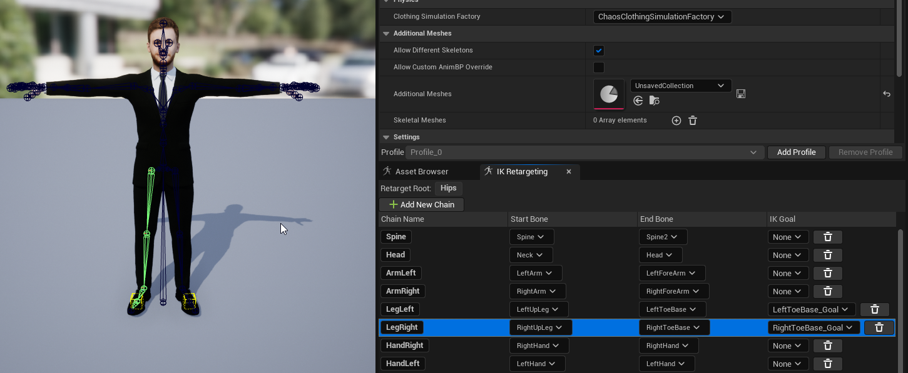

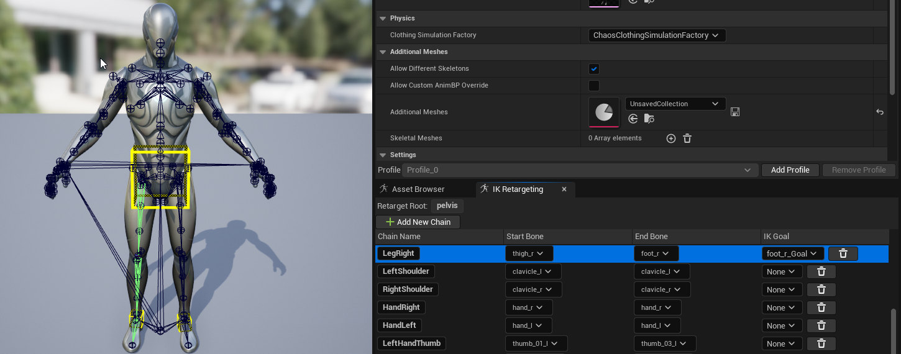

MetaPerson IK Rig contains IK goals for leg bones to reduce the unwanted artifacts where the leg meets the floor surface:

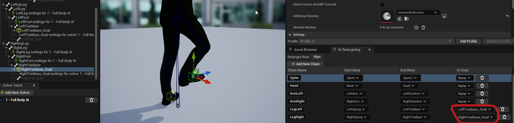

[More IK goals can be added](https://docs.unrealengine.com/5.0/en-US/ik-rig-in-unreal-engine/) to IK Rig depending on your project  requirements. 

Retargeter Asset (*/Game/MannequinToMetaperson2/IK_Retargeting/IK_Retargeter_Metaperson2*), according to documentation, is an asset and editor that references both source and target rigs, providing you with functionality to customize the retargeting results. 

Retarget chains are mapped in Retargeter Asset based on their names. We named chains in a similar way for source and target IK Rigs, so auto mapping works fine.

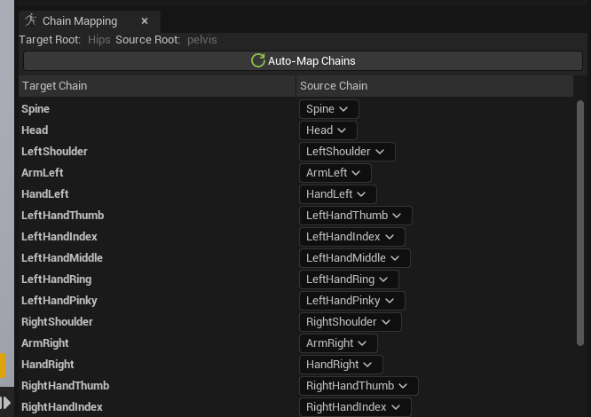

For best results with animation retargeting, the pose of the target skeletal mesh should be aligned with the source mesh.

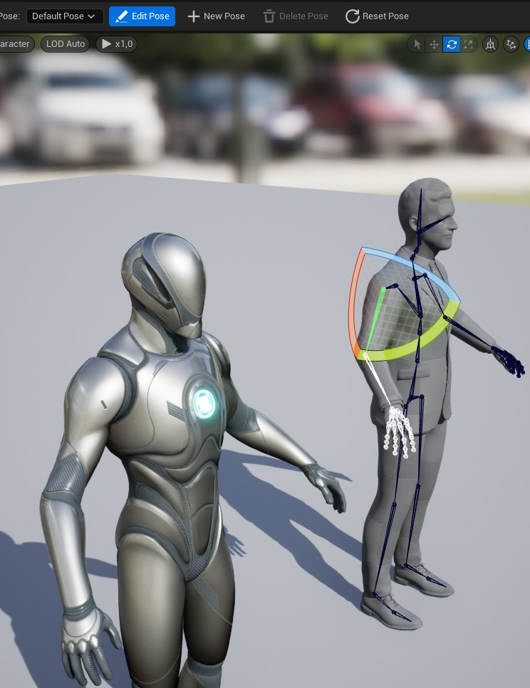

Playing a preview animation can help visualize the retargeting result.

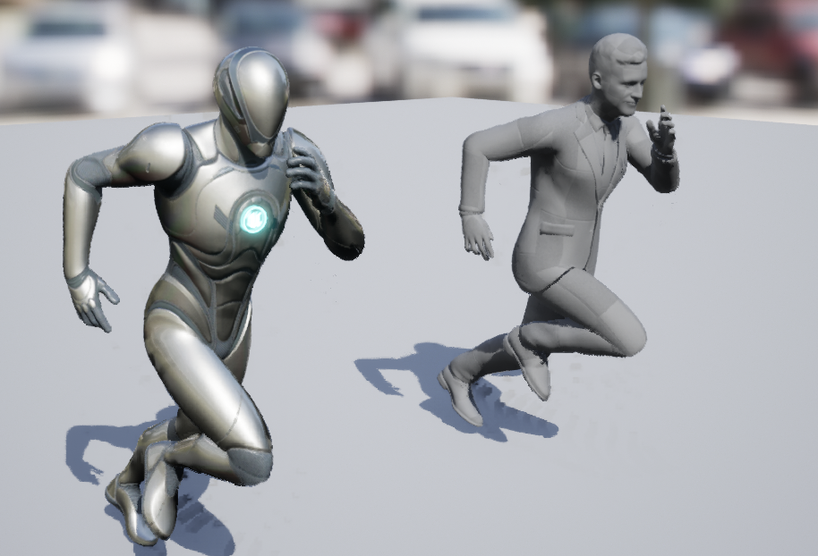

Having Retargeter Asset, one can simply retarget existing animations or animation blueprints. Our demo is based on well-known [Epic's Third Person Template](https://docs.unrealengine.com/5.0/en-US/third-person-template-in-unreal-engine/), so we can retarget the animation blueprint provided with it.

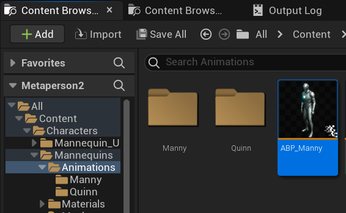

Right click on the asset opens context menu where you can find the "Duplicate and Retarget Animation Blueprint" command.

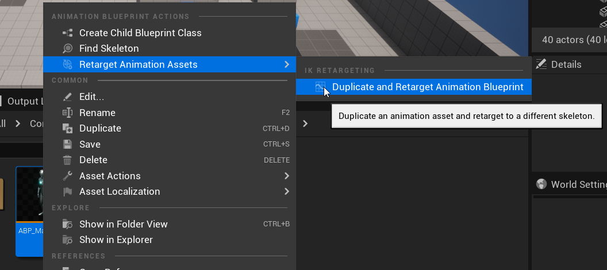

In "Duplicate and Retarget Animation Blueprint" window you need to set the IK Retageter parameter:

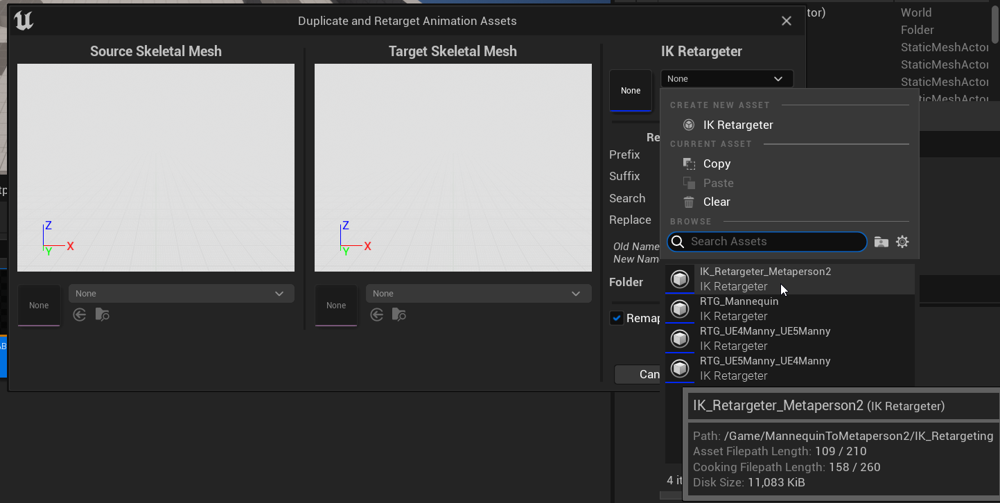

You also may find useful to set the naming parameters and destination folder:

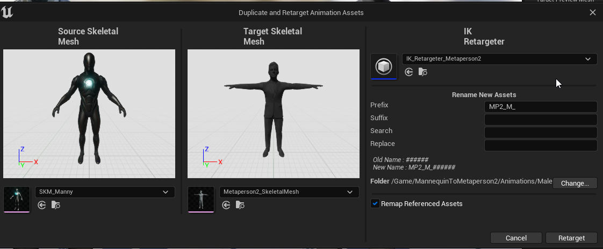

Press the "Retarget" button and explore the results:

One more thing is required to achieve the best result: open the resulting blueprint and remove the "control rig" element from the animation graph.

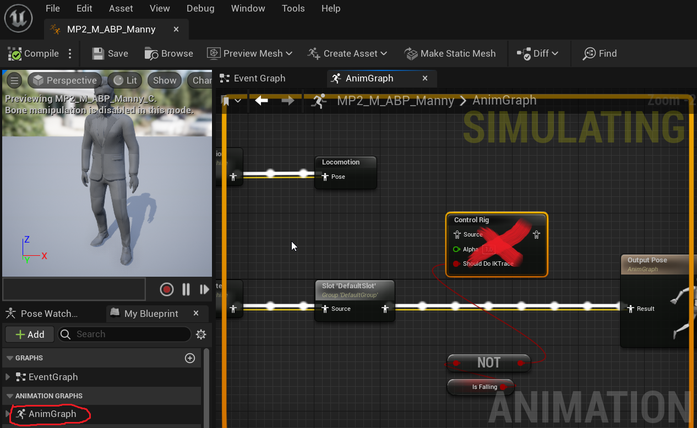

Now you can save the results and use the retargeted blueprint as an animation class for the character.

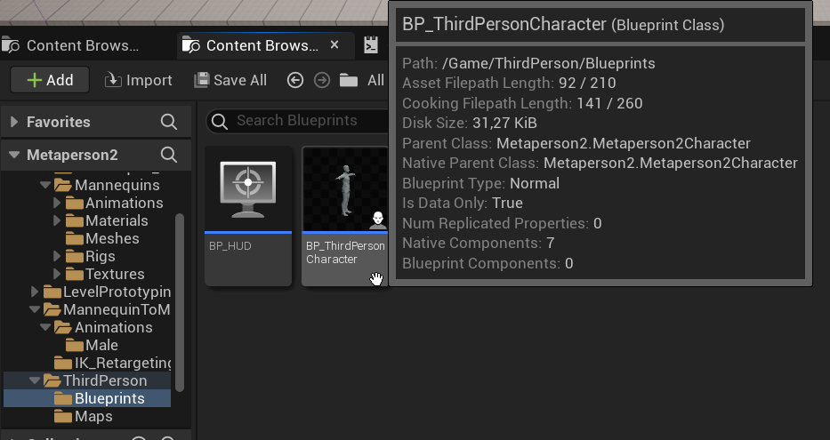

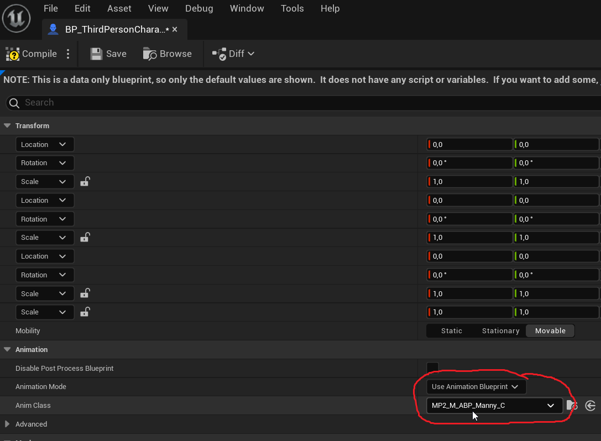

Your animations were successfully retargeted:

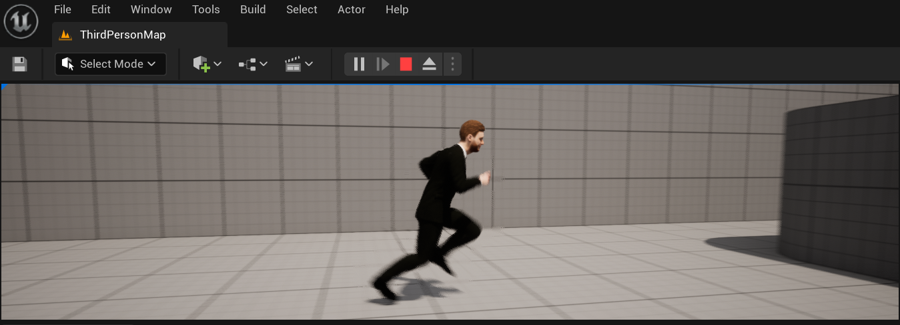