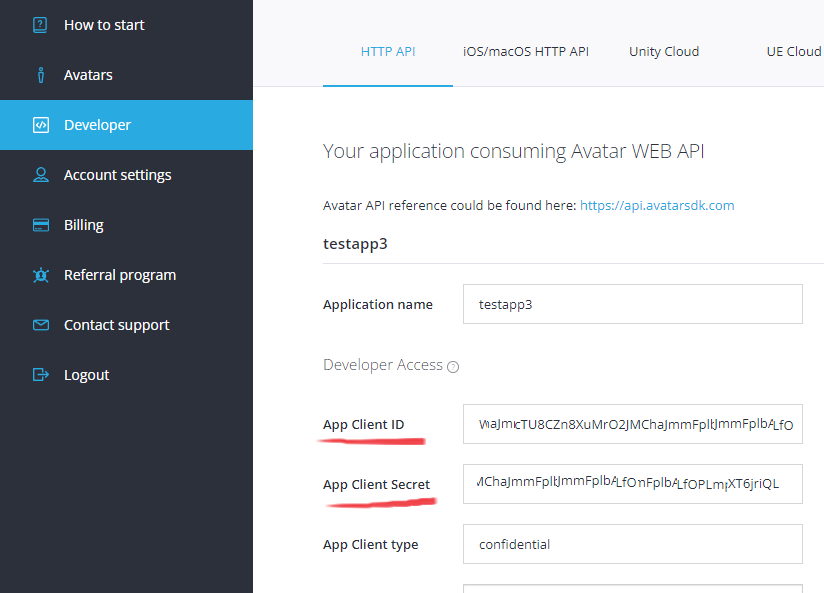
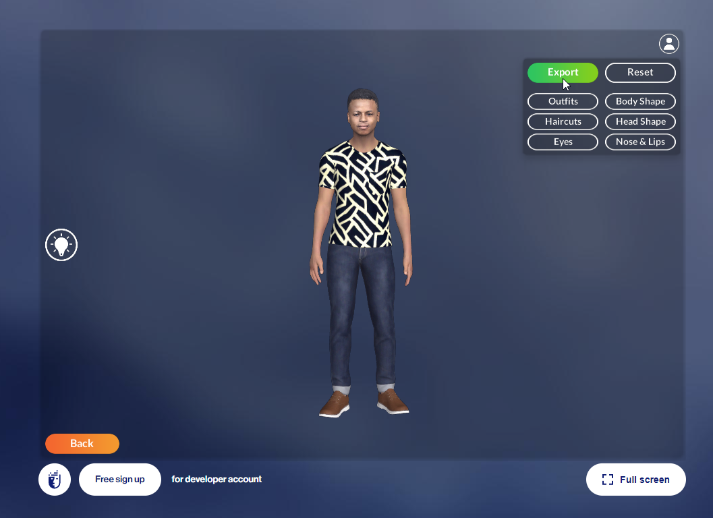

# Getting started

## Running the sample

You will need an account on the Avatar SDK website to export MetaPerson avatars. If you don't have an account yet, you can create it [here](https://accounts.avatarsdk.com/). After that you can take a [free trial](https://avatarsdk.com/pricing-cloud/) of the Pro plan. It gives you acces to all of the needed features.

To run the demo scene you will need developer credentials that can be created/found at your [developer page](https://accounts.avatarsdk.com/developer/). Developer credentials are a pair of values (Client ID and Client Secret). 

See the [additional documentation](https://docs.metaperson.avatarsdk.com/getting_started.html#developer-credentials) on the developer-credentials. 

Go to the Edit->Project Settings->Plugins->Avatar SDK Metaperson 2 section in UE Editor and set these parameters in corresponding fields:

## Sample overview

The sample is based on Epic's Third Person [template](https://docs.unrealengine.com/5.0/en-US/third-person-template-in-unreal-engine/) and demonstrates how to integrate Metaperson Creator to your project. Playing the level opens MetaPerson Creator in the HUD. After that all of the avatar creation/customization features are available to user. When the user finishes the avatar creation process, he can press the Export button. **If you’ve incorrectly added your credentials, or if your account doesn’t have a Pro plan or higher, the Export button may be inactive.**  

When the export process is complete, the MetaPerson Creator will close and the download will begin. The archive with the avatar will be saved to the local disk and unzipped. After that skeletal mesh of the avatar will be loaded from the glb file. Avatar will be placed in the level instead of the third person character.

See more information about [animation retargeting](animation_retargeting) and  [MetaPerson Creator integration](metaperson_creator_integration).