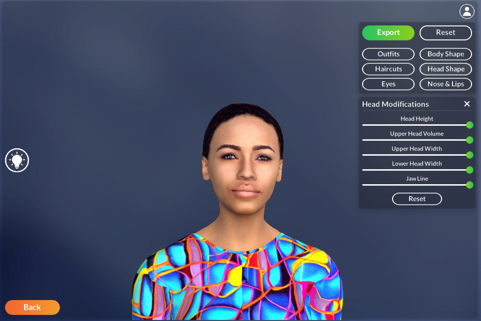

# Metaperson 2.0 Animation UE sample

This project demonstrates how to create and use Metaperson avatars with Epic animations. Please see the [Getting Started](getting_started) page if you need information on running the example.

We use the new [MetaPerson Editor](https://docs.metaperson.avatarsdk.com/) integrated to level UI to create the avatar from a selfie and customize it. 

See the [relevant part](metaperson_editor_integration) of the documentation for how Metaperson Editor can be integrated into your Unreal Engine project.

We also use UE5 [IK Rig Retargeting](https://docs.unrealengine.com/5.0/en-US/ik-rig-animation-retargeting-in-unreal-engine/) to retarget animations (and animation blueprints) from Mannequin to Metaperson 2 skeleton. 

The animation retargeting process is described in the [corresponding chapter](animation_retargeting).

