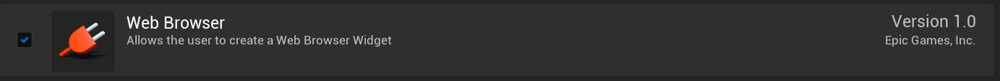
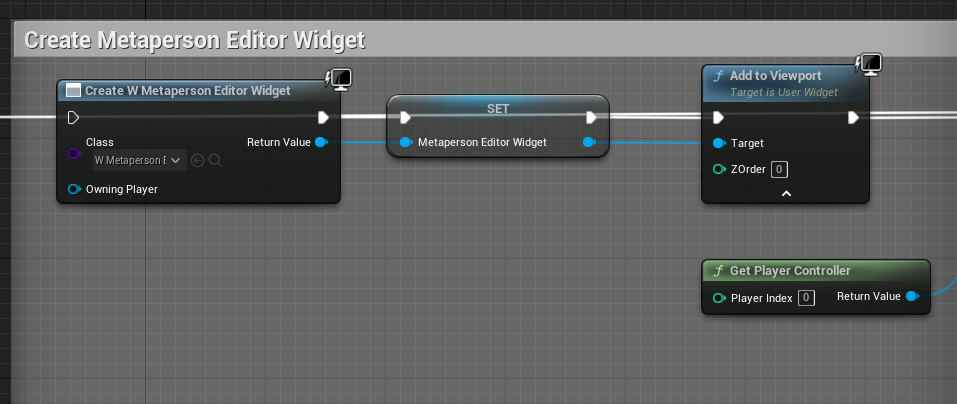
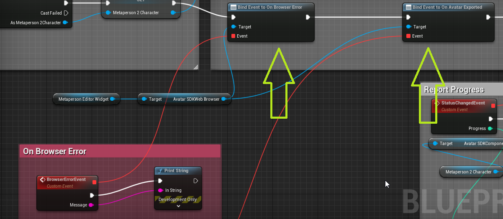
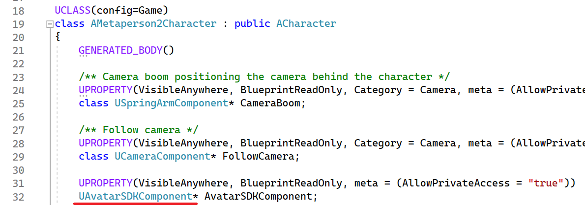
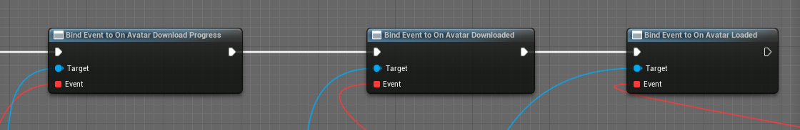

# [](#header-1)MetaPerson Creator integration

MetaPerson Creator is a revolutionary 3D avatar builder that allows you to create your own lifelike avatar using just a selfie. Because the MetaPerson Creator supports iframe integration, connecting the MetaPerson Creator to an Unreal Engine project can be done using a standard web browser plugin.



We created a small class `UAvatarSDKWebBrowser` that inherits from `UWebBrowser` and handles interactions of UE projects with the MetaPerson Creator. We use JavaScript code to subscribe to events and forward them to UE.

```javascript
function onWindowMessage(evt) {
    if (evt.type === 'message') {
        if (evt.data?.source === 'metaperson_creator') {
            let data = evt.data;
            let evtName = data?.eventName;
            if (evtName === 'unity_loaded') {
                onUnityLoaded(evt, data);
            } else if (evtName === 'model_exported') {
                window.ue.avatarsdk_proxy.avatarexportcallback(event.data.url);
            }
        }
    }
}

function onUnityLoaded(evt, data) {
    let authenticationMessage = {
        'eventName': 'authenticate',
        'clientId': CLIENT_ID,
        'clientSecret': CLIENT_SECRET,
        'exportTemplateCode': '',
    };
    evt.source.postMessage(authenticationMessage, '*');
    let exportParametersMessage = {
        'eventName': 'set_export_parameters',
        'format': 'glb',
        'lod': 1,
        'textureProfile': '2K.png'
    };
    evt.source.postMessage(exportParametersMessage, '*');

}
window.addEventListener('message', onWindowMessage);
```

We use the `UAvatarSDKBrowserCallbackProxy` class to handle the events from JavaScript and forward them to the `UAvatarSDKWebBrowser` class.

See the [documentation](https://docs.metaperson.avatarsdk.com/web_integration.html) for website integration.
In the demo project, you can see how it works by looking at the */Game/ThirdPerson/Blueprints/BP_HUD* blueprint.

At first we obviously need to create the widget and add it to the viewport.



We need to subscribe to 2 events that are raised by `UAvatarSDKWebBrowser`. The first one is `OnBrowserError` that gets raised if something gets wrong, for example if you forget to [provide your Client ID and Client Secret](getting_started). The second one is `OnAvatarExported` and it is raised when you've finished editing your avatar and it is ready to be downloaded from the cloud. At this point you can also set the `ReadParametersFromSettings` parameter to false, if you'd like to provide Client ID and Client Secret in the blueprint instead of taking it from the plugin settings.



The handler for this event must have a string as a parameter to get the URL. This URL will be used to download the avatar to your local drive. The `UAvatarSDKComponent` class is responsible for downloading avatar (`DownloadAvatar` method) and loading the skeletal mesh to the skeletal mesh component (`LoadAvatar` method). `UAvatarSDKComponent` is added to our sample character: `AMetaperson2Character` (*\Source\Metaperson2\Metaperson2Character.h*).



This component has three important events that we need to subscribe to. Their names are self-explanatory:



`UAvatarSDKComponent`'s `DownloadAvatar` saves the avatar in the application directory. For example on Windows path to avatar model can look like this: *C:\Users\USERNAME\AppData\Local\Avatar SDK Metaperson 2\avatars\b1b666a0-8a55-4d1a-acc3-540ae971c858\model.glb*, where *b1b666a0-8a55-4d1a-acc3-540ae971c858* is a unique ID of avatar. The `LoadAvatar` method creates a skeletal mesh from glb file, sets transform, materials, and plugs it into Character's skeletal mesh component. We use the [glTFRuntime plugin](https://github.com/rdeioris/glTFRuntime) to load mesh from glb at runtime.

When the LoadAvatar method completes its work, the OnAvatarLoaded event is fired. Your avatar is ready.

